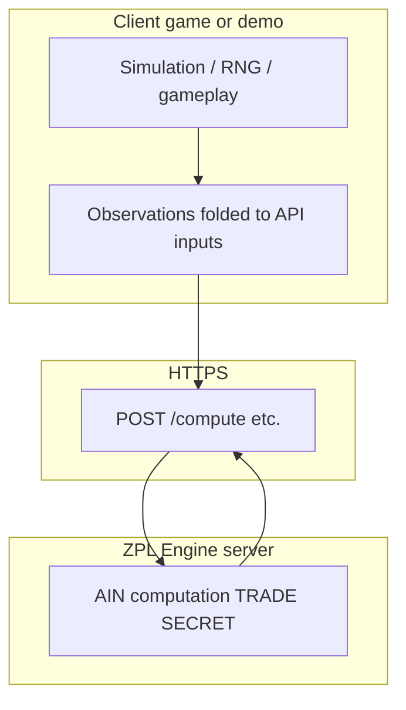

# Arhitectură: jocuri + ZPL Engine

## Principiu

**Motorul ZPL (AIN)** rulează **numai pe server** (`engine.zeropointlogic.io`). Orice „joc” — web, Unity, Godot, Unreal, Bevy, Defold, etc. — produce **observații** (numere, matrice binară, distribuții) pe care le trimite prin **HTTPS**; primește înapoi doar **suprafața publică** a API-ului (ex. `ain`, `ain_status`, `tokens_used` — exact ce permite contractul). **Fiecare motor** are propriul cod de legătură către același contract; vezi [INTEGRATIONS_UNITY_GODOT_UNREAL.md](./INTEGRATIONS_UNITY_GODOT_UNREAL.md). Demo-urile web mapate: [DEMO_CATALOG.md](./DEMO_CATALOG.md).

## Straturi (rezumat)

1. **Strat joc** — reguli, RNG (client sau server de joc), UI. Poate fi „slab” pentru demo (ex. `Math.random` cu bias controlat) sau serios (PRNG auditat) pentru produs comercial. **Acest strat nu este formula ZPL.**
2. **Strat observație** — transformi evenimentele jocului în payload-ul acceptat de API (ex. scalar `value` + `runs`/`scale` pe ruta demo BFF, sau matrice + `samples` pe contractul SDK complet spre motor).
3. **Strat măsură** — motorul returnează scoruri / status. **Secretul** rămâne aici.

## „RNG mai bun”

- **Opțional** și **separat** de ZPL: îmbunătățești povestea de **reproducibilitate / fairness** a lumii jocului.
- ZPL răspunde la întrebarea: **„datele observate sunt neutre / stabile în sensul contractului?”** — nu înlocuiește alegerea PRNG-ului tău.

## Universal vs per-gen joc

- **Universal:** același **contract HTTP** + 1–3 tipuri de input (binar, distribuție, matrice).
- **Per gen:** template-uri UX (coin, gacha, PvP) care **umplu** același contract — nu schimbă motorul.
